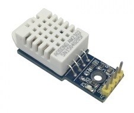

## 8x8 LED 도토 매트릭스 시계 만들기
### 준비물

- [아두이노(Arduino Uno)](http://mechasolution.com/shop/goods/goods_view.php?goodsno=71796&category=)  -1-

- [RTC모듈(DS3231, I2C)](http://mechasolution.com/shop/goods/goods_view.php?goodsno=566721&category=132001)  -1-

- [온습도센서(AM2302 DHT22)](http://mechasolution.com/shop/goods/goods_view.php?goodsno=330422&category=)  -1-    

​        cf) 저렴한 [DHT11](http://mechasolution.com/shop/goods/goods_view.php?goodsno=540035&category=)이라도 무방함

- [8x32 LED 도트 매트릭스(MAX7219)](http://www.devicemart.co.kr/goods/view?no=1330850)  -1-

