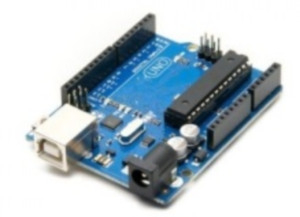
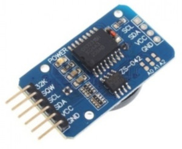
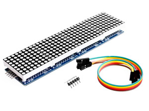
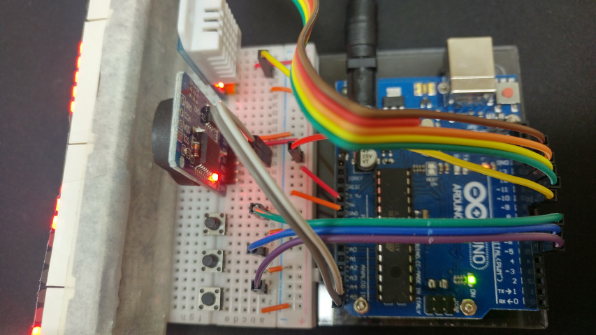
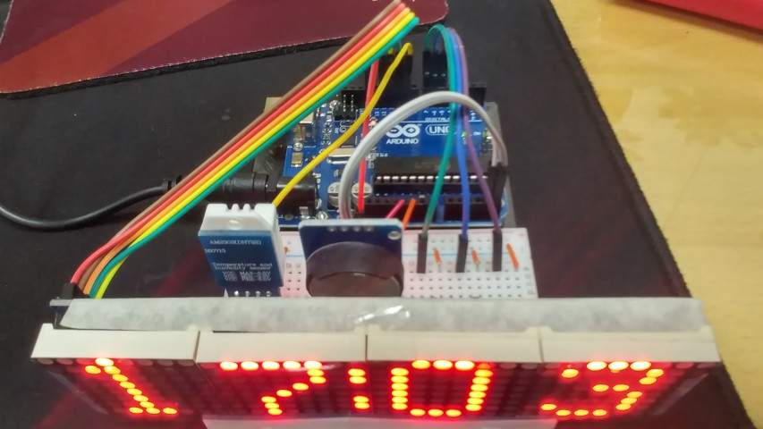
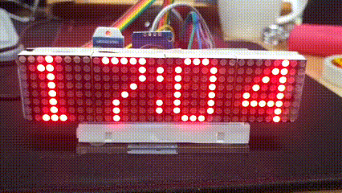

#### 8x32 LED 도토 매트릭스 시계 만들기(온도,습도 표시)
- [ ] ##### **준비물**

| [아두이노(Arduino Uno)](http://mechasolution.com/shop/goods/goods_view.php?goodsno=71796&category=)  -1- | [RTC모듈(DS3231, I2C)](http://mechasolution.com/shop/goods/goods_view.php?goodsno=566721&category=132001)  -1- |
| ------------------------------------------------------------ | ------------------------------------------------------------ |
|                                    |                                            |
| [온습도센서(AM2302 DHT22)](http://mechasolution.com/shop/goods/goods_view.php?goodsno=330422&category=)  -1- | [8x32 LED 도트 매트릭스(MAX7219)](http://www.devicemart.co.kr/goods/view?no=1330850)  -1- |
|                                          |                                   |

 cf) 온습도 센서는 저렴한 [DHT11](http://mechasolution.com/shop/goods/goods_view.php?goodsno=540035&category=) 모듈을 사용해도 됨

- [ ] ##### **회로 연결**

| 아두이노 | RTC 모듈 | 온습도센서 | 도트 매트릭스 | 푸쉬버튼 |
| :------: | :------: | :--------: | :-----------: | :------: |
| D5       D6       D7      D8      D9      D10     D11      D12    A4      A5 | -------- -------- -------- -------- -------- -------- -------- -------- SDA SCL | -------- -------- -------- -------- DAT    -------- -------- -------- -------- -------- | -------- -------- -------- -------- -------- CS   CLK DIN -------- -------- | Mode Down  Up       -------- -------- -------- -------- -------- -------- -------- |

- [ ] ##### **동작 영상**

cf) 시간을 맞추는 영상은 촬영하지 못하였음