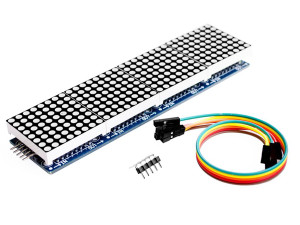
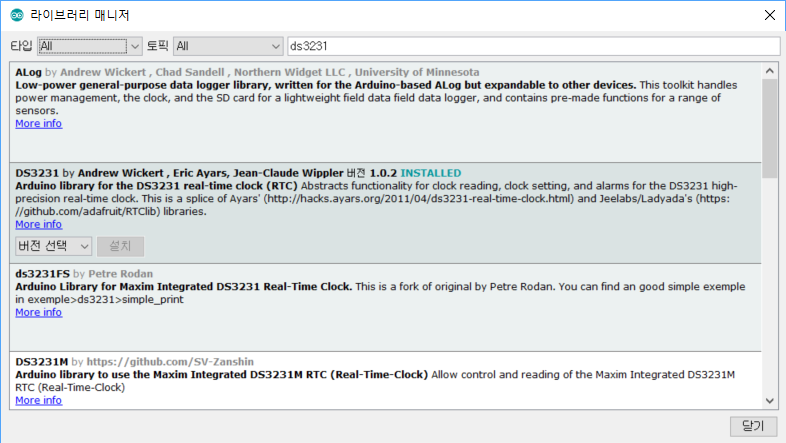

#### 8x32 LED 도토 매트릭스 시계 만들기(온도,습도 표시)

- [ ] 준비물

| [아두이노(Arduino Uno)](http://mechasolution.com/shop/goods/goods_view.php?goodsno=71796&category=)  -1- | [RTC모듈(DS3231, I2C)](http://mechasolution.com/shop/goods/goods_view.php?goodsno=566721&category=132001)  -1- |
| ------------------------------------------------------------ | ------------------------------------------------------------ |
|                                    |                                            |
| [온습도센서(AM2302 DHT22)](http://mechasolution.com/shop/goods/goods_view.php?goodsno=330422&category=)  -1- | [8x32 LED 도트 매트릭스(MAX7219)](http://www.devicemart.co.kr/goods/view?no=1330850)  -1- |
|                                          |                                   |

 cf) 온습도 센서는 저렴한 [DHT11](http://mechasolution.com/shop/goods/goods_view.php?goodsno=540035&category=) 모듈을 사용해도 됨

- [ ] 회로 연결

|                           아두이노                           |                           RTC 모듈                           |                          온습도센서                          |                        도트 매트릭스                         |                           푸쉬버튼                           |
| :----------------------------------------------------------: | :----------------------------------------------------------: | :----------------------------------------------------------: | :----------------------------------------------------------: | :----------------------------------------------------------: |
| D5       D6       D7      D8      D9      D10     D11      D12    A4      A5 | -------- -------- -------- -------- -------- -------- -------- -------- SDA SCL | -------- -------- -------- -------- DAT    -------- -------- -------- -------- -------- | -------- -------- -------- -------- -------- CS   CLK DIN -------- -------- | Mode Down  Up       -------- -------- -------- -------- -------- -------- -------- |

- [ ] 동작 영상

cf) 시간을 맞추는 영상은 촬영하지 못하였음

- [ ] 라이브러리 설치

- **온습도센서(DHT22)**

- **LED 도트 매트릭스(MAX7219)**

- **RTC(DS3231)**

- [ ] 소스 코드
~~~

#include <SimpleDHT.h>
#include <Wire.h>       // I2C 통신 라이브러리
#include "RTClib.h"     // RTC(DS3231,메카솔루션), SCL <--> A5   SDA <--> A4  VCC <--> 5V
#include "LedControl.h"                     // 8X8 LED Matrix (MAX7219)
LedControl lc = LedControl(12, 11, 10, 4);  // 핀들을 접속 (DIN 핀,CLK 핀, CS핀, 주소) 주소: 모들의 갯수

#define BTN_MODE_PIN 5
#define BTN_DOWN_PIN 6
#define BTN_UP_PIN 7
#define DHT22_PIN 9
#define BRIGHTNESS 8    // 밝기 설정(0~15까지 밝기 설정가능)
#define INTERVAL 10000  // 온습도 표시 간격(ms) /2

RTC_DS3231 rtc;         // RTC 객체 생성
SimpleDHT22 dht22(DHT22_PIN);

//char daysOfTheWeek[7][12] = {"Sunday", "Monday", "Tuesday", "Wednesday", "Thursday", "Friday", "Saturday"};

byte digits[10][8] = {
  { B00111000,  B01000100,  B01000100,  B01000100,  B01000100,  B01000100,  B01000100,  B00111000}, //0
  { B00010000,  B00110000,  B00010000,  B00010000,  B00010000,  B00010000,  B00010000,  B00111000}, //1
  { B00111000,  B01000100,  B00000100,  B00000100,  B00001000,  B00010000,  B00100000,  B01111100}, //2
  { B00111000,  B01000100,  B00000100,  B00011000,  B00000100,  B00000100,  B01000100,  B00111000}, //3
  { B00000100,  B00001100,  B00010100,  B00100100,  B01000100,  B01111100,  B00000100,  B00000100}, //4
  { B01111100,  B01000000,  B01000000,  B01111000,  B00000100,  B00000100,  B01000100,  B00111000}, //5
  { B00111000,  B01000100,  B01000000,  B01111000,  B01000100,  B01000100,  B01000100,  B00111000}, //6
  { B01111100,  B00000100,  B00000100,  B00001000,  B00010000,  B00100000,  B00100000,  B00100000}, //7
  { B00111000,  B01000100,  B01000100,  B00111000,  B01000100,  B01000100,  B01000100,  B00111000}, //8
  { B00111000,  B01000100,  B01000100,  B01000100,  B00111100,  B00000100,  B01000100,  B00111000}  //9
};

byte chars[][8] = {
  { B00000000,  B00111100,  B01100110,  B01100110,  B01111110,  B01100110,  B01100110,  B01100110}, //A 0
  { B00000000,  B01111100,  B01100110,  B01100110,  B01111100,  B01100110,  B01100110,  B01111100}, //B 1
  { B00000000,  B00111100,  B01100110,  B01100000,  B01100000,  B01100000,  B01100110,  B00111100}, //C 2
  { B00000000,  B01111100,  B01100110,  B01100110,  B01100110,  B01100110,  B01100110,  B01111100}, //D 3
  { B00000000,  B01111110,  B01100000,  B01100000,  B01111100,  B01100000,  B01100000,  B01111110}, //E 4
  { B00000000,  B01111110,  B01100000,  B01100000,  B01111100,  B01100000,  B01100000,  B01100000}, //F 5
  { B00000000,  B00111100,  B01100110,  B01100000,  B01100000,  B01101110,  B01100110,  B00111100}, //G 6
  { B00000000,  B01100110,  B01100110,  B01100110,  B01111110,  B01100110,  B01100110,  B01100110}, //H 7
  { B00000000,  B00111100,  B00011000,  B00011000,  B00011000,  B00011000,  B00011000,  B00111100}, //I 8
  { B00000000,  B00011110,  B00001100,  B00001100,  B00001100,  B01101100,  B01101100,  B00111000}, //J 9
  { B00000000,  B01100110,  B01101100,  B01111000,  B01110000,  B01111000,  B01101100,  B01100110}, //K 10
  { B00000000,  B01100000,  B01100000,  B01100000,  B01100000,  B01100000,  B01100000,  B01111110}, //L 11
  { B00000000,  B01100011,  B01110111,  B01111111,  B01101011,  B01100011,  B01100011,  B01100011}, //M 12
  { B00000000,  B01100011,  B01110011,  B01111011,  B01101111,  B01100111,  B01100011,  B01100011}, //N 13
  { B00000000,  B00111100,  B01100110,  B01100110,  B01100110,  B01100110,  B01100110,  B00111100}, //O 14
  { B00000000,  B01111100,  B01100110,  B01100110,  B01100110,  B01111100,  B01100000,  B01100000}, //P 15
  { B00000000,  B00111100,  B01100110,  B01100110,  B01100110,  B01101110,  B00111100,  B00000110}, //Q 16
  { B00000000,  B01111100,  B01100110,  B01100110,  B01111100,  B01111000,  B01101100,  B01100110}, //R 17
  { B00000000,  B00111100,  B01100110,  B01100000,  B00111100,  B00000110,  B01100110,  B00111100}, //S 18
  { B00000000,  B01111110,  B01011010,  B00011000,  B00011000,  B00011000,  B00011000,  B00011000}, //T 19
  { B00000000,  B01100110,  B01100110,  B01100110,  B01100110,  B01100110,  B01100110,  B00111110}, //U 20
  { B00000000,  B01100110,  B01100110,  B01100110,  B01100110,  B01100110,  B00111100,  B00011000}, //V 21
  { B00000000,  B01100011,  B01100011,  B01100011,  B01101011,  B01111111,  B01110111,  B01100011}, //W 22
  { B00000000,  B01100011,  B01100011,  B00110110,  B00011100,  B00110110,  B01100011,  B01100011}, //X 23
  { B00000000,  B01100110,  B01100110,  B01100110,  B00111100,  B00011000,  B00011000,  B00011000}, //Y 24
  { B00000000,  B01111110,  B00000110,  B00001100,  B00011000,  B00110000,  B01100000,  B01111110}, //Z 25
  { B00000000,  B00000000,  B00100010,  B00010100,  B00001000,  B00010100,  B00100010,  B00000000}, //x 26
  { B01000000,  B10100110,  B01001001,  B00010000,  B00010000,  B00010000,  B00001001,  B00000110}, //oC 27
  { B01000100,  B10100100,  B10101000,  B01001000,  B00010010,  B00010101,  B00100101,  B00100010} //% 28
};

uint8_t now_hour, now_min, now_sec;
uint8_t mode = 0;       //mode 0:clock , 1:hour setting ,  2: min setting
uint8_t flag = true;
unsigned long previousMillis = 0;     // will store last time
//const long interval = 10000;           // interval at which to blink (milliseconds)

void setup () {
  Serial.begin(115200);
  delay(500);

  // 8X8 LED Martix
  for (int MatNo = 0; MatNo < 4; MatNo++) {
    lc.shutdown(MatNo, false);         // 절전모드 종료하고 화면 켜기
    lc.setIntensity(MatNo, BRIGHTNESS); // 밝기를 설정(0~15까지 밝기 설정가능)
    lc.clearDisplay(MatNo);            // 화면지우기
  }

  // RTC
#ifndef ESP8266
  while (!Serial); // for Leonardo/Micro/Zero
#endif

  if (! rtc.begin()) {
    display_RTC_error();
    Serial.println("Couldn't find RTC");
    while (1);
  }
  if (rtc.lostPower()) {
    Serial.println("RTC lost power, lets set the time!");
    rtc.adjust(DateTime(F(__DATE__), F(__TIME__)));
    rtc.adjust(DateTime(2019, 01, 01, 00, 00, 00)); // default 날짜_시간 설정
  }

  // Arduino GPIO
  pinMode(BTN_UP_PIN, INPUT_PULLUP);    // up
  pinMode(BTN_DOWN_PIN, INPUT_PULLUP);  // down
  pinMode(BTN_MODE_PIN, INPUT_PULLUP);  // mode
  //  pinMode(13, OUTPUT);

}

//=======================
void loop () {
  // RTC
  DateTime now = rtc.now();

  // 현재 시간, 분 저장
  now_hour = now.hour();
  now_min = now.minute();
  //  now_sec = now.second();
  
  float temperature = 0;
  int i_temp;
  float humidity = 0;
  int i_humi;
  int err = SimpleDHTErrSuccess;
  unsigned long currentMillis = millis();

  if (currentMillis - previousMillis >= INTERVAL) {
    previousMillis = currentMillis;
    if ((err = dht22.read2(&temperature, &humidity, NULL)) != SimpleDHTErrSuccess){
      display_DHT22_error();    // 온습도계 오류 표시
      delay(1500);
    }else{
      i_temp = (int)(temperature*10.);
      i_humi = (int)(humidity*10.);
      display_tempNhumi(i_temp/100, (i_temp%100)/10, i_temp%10, 27); // 온도 표시
      display_dp();   // 소수점 표시
      delay(1500);
      display_tempNhumi(i_humi/100, (i_humi%100)/10, i_humi%10, 28); // 습도 표시
      display_dp();   // 소수점 표시
      delay(1500);
    }
  }
  
  //모드 변경
  if (digitalRead(BTN_MODE_PIN) == LOW) {
    delay(50);  // 채터링 방지
    while (digitalRead(BTN_MODE_PIN) == LOW); // 눌렀다 뗄 때까지 기다림 rising edge trigger
    mode = ++mode % 3;
  }

  while (mode) {
    // 시간 조정
    if (mode == 1) {
      if (digitalRead(BTN_UP_PIN) == LOW) // UP 버튼 누르면
        now_hour = ++now_hour % 24;
      if (digitalRead(BTN_DOWN_PIN) == LOW) { // DOWN 버튼 누르면
        if (--now_hour <= 0)
          now_hour += 24;
        now_hour %= 24;
      }
    }// 시간 조정 end

    // 분 조정
    if (mode == 2) {
      if (digitalRead(BTN_UP_PIN) == LOW) // UP 버튼 누르면
        now_min = ++now_min % 60;
      if (digitalRead(BTN_DOWN_PIN) == LOW) { // DOWN 버튼 누르면
        if (--now_min <= 0)
          now_min += 60;
        now_min %= 60;
      }
    }// 분 조정 end

    // 화면 표시
    display_time(now_hour / 10, now_hour % 10, now_min / 10, now_min % 10);
    display_sec();
    delay(100);
    display_clear(mode);
    delay(100);

    // 모드 변경
    if (digitalRead(BTN_MODE_PIN) == LOW) {
      delay(50);  // 채터링 방지
      while (digitalRead(BTN_MODE_PIN) == LOW); // 눌렀다 뗄 때까지 기다림 rising edge trigger
      mode = ++mode % 3;
    }
    if (mode == 0)
      rtc.adjust(DateTime(2019, 11, 17, now_hour, now_min, 00)); // 날짜_시간 설정

  } // End While

  // 화면 표시
  if (now_hour < 24 || now_min < 60) {  // 오류 없으면
    //시간,분 표시
    display_time(now_hour / 10, now_hour % 10, now_min / 10, now_min % 10);
    Serial.println(String(now_hour) + ":" + String(now_min) + ":" + String(now_sec));

    //초 깜빡임 표시
    display_sec();
  } else {
    display_RTC_error();
  }// 화면 표시 end

  delay(500);

} //End loop ==================

// 시간:분 구분 기호(초 깜빡임) 표시
void display_sec() {
  flag = !flag;
  lc.setLed(1, 1, 7, flag); //lc.setLed(no,col,row,true);
  lc.setLed(1, 2, 7, flag);
  lc.setLed(1, 5, 7, flag);
  lc.setLed(1, 6, 7, flag);
}

// 온습도 표시
void display_tempNhumi(int temp10, int temp1, int temp01, int unit) {
  for (int line = 0; line < 8; line++) {
    lc.setRow(0, line, digits[temp10][line]); // 10s temp/humi
    lc.setRow(1, line, digits[temp1][line]);  // 1s temp/humi
    lc.setRow(2, line, digits[temp01][line]); // 0.1s temp/humi
    lc.setRow(3, line, chars[unit][line]);    // c or %
  }
}

// 소수점 표시
void display_dp() {
  flag = !flag;
  lc.setLed(1, 6, 7, true); //lc.setLed(no,col,row,true);
  lc.setLed(1, 7, 7, true);
//  lc.setLed(2, 6, 0, true); //lc.setLed(no,col,row,true);
//  lc.setLed(2, 7, 0, true);
}

// 시간,분 표시
void display_time(int hour10, int hour1, int min10, int min1) {
  for (int line = 0; line < 8; line++) {
    lc.setRow(0, line, digits[hour10][line]); // 10s hour
    lc.setRow(1, line, digits[hour1][line]);  // 1s hour
    lc.setRow(2, line, digits[min10][line]);  // 10s minute
    lc.setRow(3, line, digits[min1][line]);   // 1s minute
  }
}

// 화면 지우기
void display_clear(int mode) {
  if (mode == 1) { // 시간 조정
    for (int MatNo = 0; MatNo < 2; MatNo++) {
      lc.clearDisplay(MatNo);
    }
  }
  if (mode == 2) { // 분 조정
    for (int MatNo = 2; MatNo < 4; MatNo++) {
      lc.clearDisplay(MatNo);
    }
  }
}

// 온습도계 오류 표시
void display_DHT22_error() {
  for (int line = 0; line < 8; line++) {
    lc.setRow(0, line, chars[19][line]); // T
    lc.setRow(1, line, chars[12][line]); // M
    lc.setRow(2, line, chars[15][line]); // P
    lc.setRow(3, line, chars[26][line]); // x
  }
}

// RTC 오류 표시
void display_RTC_error() {
  for (int line = 0; line < 8; line++) {
    lc.setRow(0, line, chars[17][line]); // R
    lc.setRow(1, line, chars[19][line]); // T
    lc.setRow(2, line, chars[ 2][line]); // C
    lc.setRow(3, line, chars[26][line]); // x
  }
}

~~~
